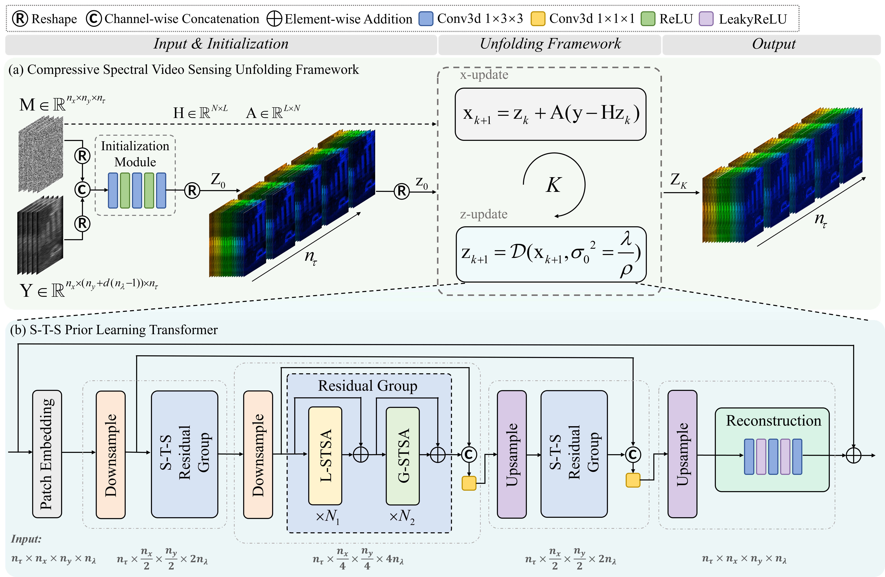

# CSVSUF

Official PyTorch Implementation of [CSVSUF: A Deep Unfolding Framework for Compressive Spectral Video Sensing](https://ieeexplore.ieee.org/document/11559234)


**Abstract**

Spectral videos (SVs) capture spatio-temporal-spectral information from dynamic scenes, but their acquisition traditionally requires expensive and complex systems, motivating the development of compressive spectral video sensing (CSVS). It typically employs the coded aperture snapshot spectral imager (CASSI) to acquire compressed measurements, from which SVs are reconstructed via model-driven or learning-based algorithms. However, two major limitations remain in current CASSI-based reconstruction methods: 1) conventional model-driven algorithms rely on iterative optimization, which limits their representational capacity in complex scenes and results in slow reconstruction; 2) existing deep learning-based approaches overlook the joint modeling of spatial, temporal, and spectral correlations, failing to fully exploit the multi-dimensional dependencies. Hence, we propose a principled compressive spectral video sensing unfolding framework (CSVSUF) in a CASSI system for spectral video reconstruction. Moreover, we develop a novel spatio-temporal-spectral prior-learning Transformer (STS-PLT) to capture the multi-dimensional correlations within each unfolding stage. By treating STS-PLT as a Gaussian denoiser for the prior term in CSVSUF, we establish a deep unfolding-based method for CSVS. Extensive experiments demonstrate that our method consistently outperforms existing approaches in both reconstruction accuracy and visual quality, validating the benefit of combining physics-guided modeling with deep prior learning in CSVS.


**Architecture**




## Setup

First, download and set up the repo:

```shell
git clone https://github.com/zli1024/CSVSUF.git
```

Next, install the dependencies listed below:

- python==3.10
- einops==0.8.2
- scipy==1.15.3
- tqdm==4.68.3
- fvcore==0.1.5.post20221221
- tensorboard==2.20.0
- torch==2.7.1+cu118

```shell
pip install einops scipy tqdm fvcore tensorboard
pip3 install torch torchvision --index-url https://download.pytorch.org/whl/cu118
```


## Datasets Preparation

Download the preprocessed dataset: [Baidu Disk](https://pan.baidu.com/s/1cCFcY7DOoqDkd7xznREh4Q?pwd=js62) (code: js62) or [Google Drive](https://drive.google.com/file/d/1ZbhERL2UiBNa8_O1WoeyzlleaYI8gjwm/view?usp=sharing).

The original dataset is from [HOT2024](https://www.hsitracking.com/).


## Usage

### Train

We use 4 GPUs to train our model CSVSUF-Kstg. The training results are saved in `experiments/`.

```shell
cd CSVSUF
sh train.sh
```

*The default model is CSVSUF-3stg. Please refer to* `train.sh` *for training different models.* 


### Test

The pretrained weights are available at [Baidu Disk](https://pan.baidu.com/s/1aFMcvNWQOtS6uO5xQ6kzTA?pwd=y7by) (code: y7by) or [Google Drive](https://drive.google.com/file/d/1hI6cWU70_f4iCV2lxpoieN0HVQIZiLaI/view?usp=sharing). Download the pretrained weights, and then put the folder `model_zoo` into `CSVSUF/`. One GPU is enough to test our model CSVSUF-Kstg. The test results are saved in `experiments/`.

```shell
cd CSVSUF
sh test.sh
```

*The default model is CSVSUF-3stg. Please refer to* `test.sh` *for testing different models.*

*The default test scene is* `rainystreet5`. Please modify the `opt.testset_path` option in `options.py` to test different video scenes.


## Acknowledgements

Our code is built upon the following open-source projects. We appreciate their generous contributions.

- https://github.com/caiyuanhao1998/MST
- https://github.com/JingyunLiang/VRT

We also thank C. Barajas-Solano, J.-M. Ramirez, J. I. M. Torre, and H. Arguello for sharing their codes, which we utilized to conduct our comparative experiments.


## Citation

```tex
@ARTICLE{11559234,
  author={Li, Zhilin and Wang, Han and Duan, Jizhong and Li, Baihua and Liu, Yu},
  journal={IEEE Transactions on Image Processing}, 
  title={CSVSUF: A Deep Unfolding Framework for Compressive Spectral Video Sensing}, 
  year={2026},
  volume={35},
  number={},
  pages={6416-6431},
  keywords={Videos;Modeling;PSNR;Measurement;Optimization;Windows;Testing;Timing;Learning systems;Training;Spectral video acquisition;compressive spectral imaging;compressive spectral video sensing;CASSI;deep unfolding},
  doi={10.1109/TIP.2026.3700920}}

```


